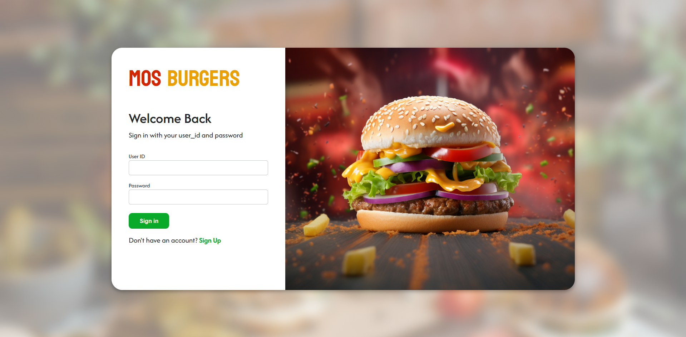
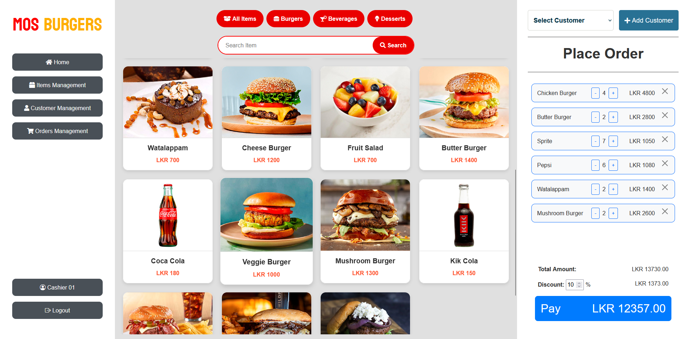
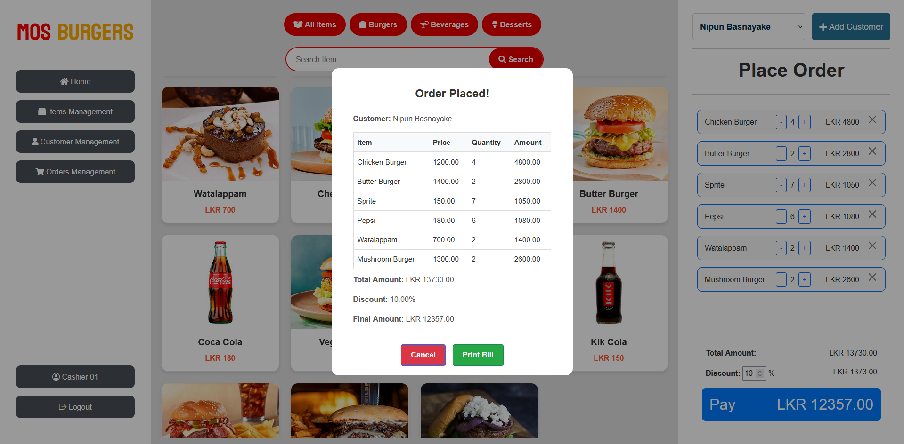
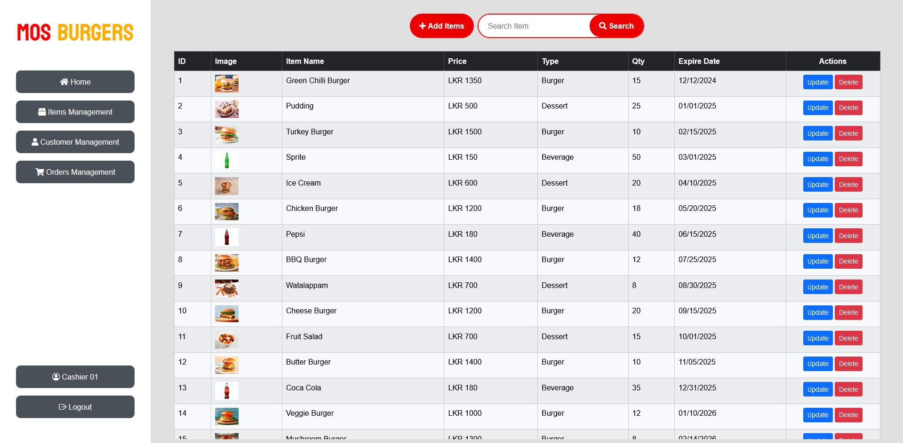
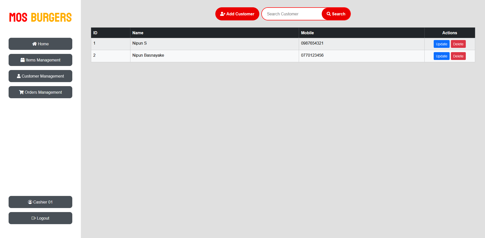
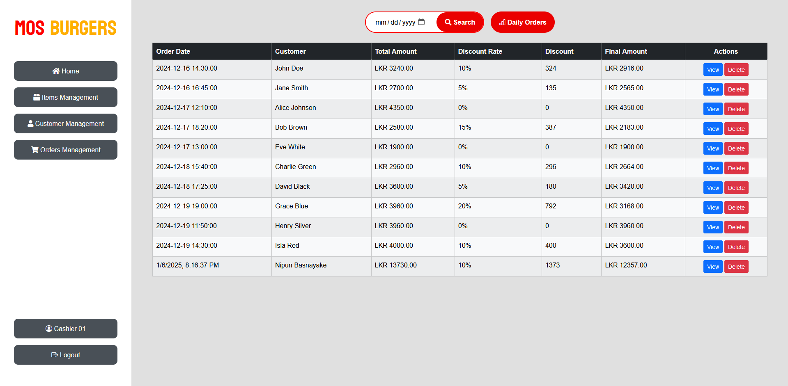

# **MOS Burgers**

## **Overview**
The MOS Burgers project is a front-end web-based application designed to streamline the ordering and management process for MOS Burgers. It provides a clean, responsive interface with essential functionalities such as managing items, customers, and orders.

---

## **Features**
- **CRUD Operations**:
  - Add, View, Update, and Delete (CRUD) functionality for:
    - Menu Items
    - Customers
    - Orders
- **Sorting**:
  - Sort items, customers, and orders dynamically for better organization.
- **PDF Generation**:
  - Export data as PDF files using the jsPDF library.
- **Responsive Design**:
  - Built with Bootstrap for an intuitive and mobile-friendly user interface.

---

## **Technologies Used**
- **Programming Languages**: HTML, CSS (Bootstrap), JavaScript
- **Library**: jsPDF for generating PDF reports

---

## **Project Status**
- **Completed**: All features have been implemented, and the project is ready for use.

---

## **Usage**
1. **Manage Items**:
   - Add new menu items, view details, update information, and delete items as needed.
2. **Manage Customers**:
   - View, add, update, and remove customer details.
3. **Manage Orders**:
   - Create, view, sort, and delete orders.
4. **Export Data**:
   - Use the "Export to PDF" option to generate and download PDF reports.
5. **Sorting**:
   - Click on column headers to sort items, customers, and orders.

---

## **Screenshots**
### **UI Screenshots**

---

## **Contributing**
Contributions are welcome! If you would like to contribute to this project, please fork the repository and submit a pull request with your changes. Ensure your code follows best practices.

---

## **License**
This project is licensed under the MIT License. See the LICENSE file for more details.

---

## **Credits**
- **Developer**: Nipun Basnayake
- **Libraries Used**:
  - Bootstrap for UI
  - jsPDF for PDF generation

---

## **Contact**
For feedback, questions, or collaboration, reach out to:
- Email: [nipunsathsara1999@gmail.com](mailto:nipunsathsara1999@gmail.com)
- GitHub: [NipunBasnayake](https://github.com/NipunBasnayake)
