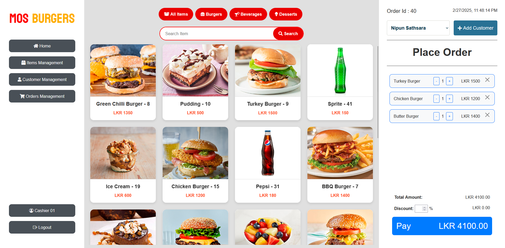

# **MOS Burgers**

## **Overview**
The MOS Burgers project is a full-stack web application designed to streamline the ordering and management process for MOS Burgers. The application features a Spring Boot-based backend that provides RESTful APIs, and a responsive front-end built with HTML, CSS, JavaScript, and Bootstrap.

---

## **Features**

### Backend
- **Spring Boot Framework**: Utilized for building the backend services, ensuring a robust and scalable application.
- **Spring Data JPA**: Employed for seamless interaction with the database, facilitating efficient data management.
- **Password Encryption**: Implemented using Jasypt to securely encrypt user passwords, enhancing security.
- **RESTful APIs**: Developed to handle CRUD operations for menu items, customers, and orders, enabling smooth communication between the frontend and backend.

### Frontend
- **CRUD Operations**:
  - Add, View, Update, and Delete functionality for:
    - Menu Items
    - Customers
    - Orders
- **Order Placement**:
  - Place orders linked to specific customers for better tracking and management.
- **Data Export**:
  - Export data as PDF files using the jsPDF library.
- **Responsive Design**:
  - Built with Bootstrap for an intuitive and mobile-friendly user interface.

---

## **Technologies Used**

### Backend
- **Programming Language**: Java
- **Frameworks and Libraries**:
  - **Spring Boot**: For building the backend services.
  - **Spring Data JPA**: For database interactions.
  - **Jasypt**: For encrypting sensitive information like passwords.

### Frontend
- **Programming Languages**: HTML, CSS (Bootstrap), JavaScript
- **Libraries**:
  - **jQuery**: For simplified DOM manipulation and event handling.
  - **SweetAlert2**: For stylish and customizable alerts.
  - **Bootstrap**: For responsive design and UI components.
  - **jsPDF**: For generating PDF reports.
  - **Bootstrap Icons**: For vector-based icons.
  - **FontAwesome**: For additional icons.

---

## **Project Status**
- **Completed**: All features have been implemented, and the project is ready for use.

---

## **Usage**

1. **Backend Setup**:
   - **Clone the Repository**: `git clone https://github.com/NipunBasnayake/MOS_Burgers-SpringBoot.git`
   - **Navigate to Backend Directory**: `cd MOS_Burgers-SpringBoot/backend`
   - **Build the Project**: Use Maven or Gradle to build the project.
   - **Run the Application**: `java -jar target/mosburgers-backend.jar`

2. **Frontend Setup**:
   - **Navigate to Frontend Directory**: `cd MOS_Burgers-SpringBoot/frontend`
   - **Open `index.html`**: Launch the `index.html` file in a web browser to start using the application.

3. **Manage Items**:
   - Add new menu items, view details, update information, and delete items as needed.

4. **Manage Customers**:
   - View, add, update, and remove customer details.

5. **Manage Orders**:
   - Create, view, sort, and delete orders.

6. **Export Data**:
   - Use the "Export to PDF" option to generate and download PDF reports.

7. **Sorting**:
   - Click on column headers to sort items, customers, and orders.

---

## **Screenshots**

---

## **Contributing**
Contributions are welcome! If you would like to contribute to this project, please fork the repository and submit a pull request with your changes. Ensure your code follows best practices.

---

## **License**
This project is licensed under the MIT License. See the LICENSE file for more details.

---

## **Credits**
- **Developer**: Nipun Basnayake
- **Libraries Used**:
  - Bootstrap for UI
  - jsPDF for PDF generation

---

## **Contact**
For feedback, questions, or collaboration, reach out to:
- Email: [nipunsathsara1999@gmail.com](mailto:nipunsathsara1999@gmail.com)
- GitHub: [NipunBasnayake](https://github.com/NipunBasnayake)

